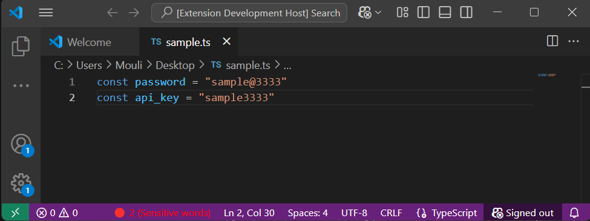

# Safe Code

**Safe Code** is a Visual Studio Code extension that automatically detects **sensitive information** (passwords, API keys, tokens, emails, etc.) in your code files and provides a **real-time status bar indicator**. Keep your code safe and avoid accidental leaks while coding!  

  
*(Add your screenshot in `images/safe-code-demo.png` to showcase the red/green dot in the status bar.)*

---

## Features

- **Real-time detection** of sensitive words and patterns in open files.  
- **Status bar indicator**:  
  - Green dot when no sensitive info is found (`🟢 0 (Sensitive words)`)  
  - Red dot when sensitive info is detected (`🔴 2 (Sensitive words)`)  
- **Quick navigation**: Click the status bar dot to see a list of detected sensitive words and jump directly to them.  
- **Supports multiple file types**: JavaScript, TypeScript, Python, plaintext, and more.  
- **Robust detection patterns**: Matches keywords like `password`, `secret`, `apiKey`, long tokens, emails, and numeric sequences.  
- **Highly configurable** (future updates can allow custom sensitive words).  

---

## Requirements

- **VS Code** version `1.104.0` or higher.  
- No additional dependencies are required.  

---

## Extension Usage

1. Open a code file in VS Code.  
2. The status bar will display a **green dot** if no sensitive info is detected.  
3. If any sensitive word or pattern is found, the dot turns **red** with a count of violations.  
4. Click the **status bar dot** to see the list of sensitive words and navigate directly to their locations in the file.  

---

## Contributed Settings

Currently, this extension does not have configurable settings. Future versions may allow users to **add custom sensitive words** via `settings.json`.  

---

## Known Issues

- May not catch **obfuscated or encoded sensitive data**.  
- Works only on **currently opened text editors**. Switching files will update the detection, but new files must be opened in VS Code to trigger detection.  

---

## Release Notes

### 1.0.0

- Initial release of Safe Code.  
- Real-time detection of sensitive words in code files.  
- Status bar indicator with click navigation.  
- Supports JavaScript, TypeScript, plaintext, and common patterns.  

---

## Contributing

Contributions are welcome! Please fork the repository and submit pull requests for improvements, new detection patterns, or bug fixes.  

---

## Support

- GitHub Issues: [Create an issue](https://github.com/<your-username>/safe-code/issues)  
- Email: `<your-email>`  

---

## Learn More

- [Visual Studio Code Extensions API](https://code.visualstudio.com/api)  
- [VS Code Marketplace Publishing Guide](https://code.visualstudio.com/api/working-with-extensions/publishing-extension)  

---

**Keep your code safe — don’t let sensitive information slip!**
